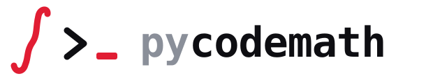

<p align="center">
  <picture>
    <source media="(prefers-color-scheme: dark)" srcset="assets/pycodemath-lockup.svg">
    
  </picture>
</p>

<p align="center">
  <strong>Token-efficient exact math for AI agents.</strong>
</p>

<p align="center">
  <a href="LICENSE"></a>
  
  
  
  <a href="https://github.com/cybersora9/pycodemath/actions/workflows/ci.yml"></a>
</p>

Write math in a few characters, get an exact answer or standalone, optimized
Python/NumPy code back — instead of asking a language model to "do arithmetic
in its head" or to hand-write numerical loops.

Built as a thin, disciplined layer over SymPy + NumPy:

1. **Cut tokens** — one short command in, one exact result out. Perfect as an
   agent tool (MCP server included).
2. **Better code than naive Python** — the generator applies symbolic
   simplification + common-subexpression elimination (CSE) before emitting
   code (measured ~1.7x faster than naive expansion on repeated
   subexpressions).

```
text → [parser] → IR (expression tree) → [engine]     evaluate / simplify / solve
                                       → [generator]  IR → CSE → Python/NumPy source
```

## Install

```bash
pip install -e .                  # core: sympy + numpy
pip install -e .[mcp]             # + MCP server for AI agents
pip install -e .[dev]             # + pytest
```

Requires Python ≥ 3.11.

## Quick start

### One-shot CLI (scriptable)

Every command below is a real invocation with its real output.

```console
$ python -m pycodemath "diff sin(x)*x dx"
x*cos(x) + sin(x)

$ python -m pycodemath "integrate 2*x dx"
x**2

$ python -m pycodemath "solve x^2 - 4 for x"
-2, 2

$ python -m pycodemath "sin(x)^2 + cos(x)^2"
1

$ python -m pycodemath "eig [[2,1],[1,2]]"
3, 1

$ python -m pycodemath "solve_nd x^2+y^2-4; x-y for x,y at 1,1"
x = 1.4142135623746899, y = 1.4142135623746899
```

Errors go to stderr with exit code 1, results to stdout with exit code 0 —
safe to call from scripts and agent tools. On Windows consoles set
`PYTHONUTF8=1`.

### REPL

```bash
python -m pycodemath        # or just: pycodemath
```

Type `help` for the full command table (derivatives, integrals, equation
solving, matrices, root finding, optimization, the whole ODE suite, and code
generation).

### MCP server (math for any AI agent)

```bash
pip install -e .[mcp]
claude mcp add pycodemath -- python -m pycodemath.cli.mcp_server
```

Exposes one tool, `math_eval`, that accepts the same commands as the REPL —
an agent sends `diff sin(x)*x dx` and receives `x*cos(x) + sin(x)` exactly,
with zero mental arithmetic.

### Use it as a Claude Code skill

The MCP server above is the portable path — it plugs into **any** MCP client.
If you specifically use [Claude Code](https://claude.com/claude-code), you can
also wire Pycodemath in as a **skill**, so Claude reaches for the engine on its
own whenever a prompt needs real math (no MCP process to keep running).

**What it changes:** instead of computing "in its head" — where a large model
can quietly get arithmetic, an integral, or an eigenvalue wrong — Claude shells
out to the engine and pastes back an exact SymPy/NumPy result. One short command
in, one exact line out: fewer tokens, no silent mistakes.

**Deploy (once):**

```bash
pip install pycodemath          # or: pip install -e .   (from a clone)
mkdir -p ~/.claude/skills/pycodemath
```

Save the following as `~/.claude/skills/pycodemath/SKILL.md`:

```markdown
---
name: pycodemath
description: Compute math with the local Pycodemath engine (SymPy+NumPy) instead
  of in your head — derivatives, integrals, solving equations and systems
  (linear and nonlinear), determinants/inverses/eigenvalues, gradients/Jacobians/
  Hessians, function minima, ODEs, and optimized Python/NumPy code generation
  (CSE). Use whenever the user asks to compute or verify symbolic/numerical math,
  or to generate code from a formula.
---

# Pycodemath — local math engine

One command = one call (the package is pip-installed, so any working directory):

    python -m pycodemath "<command>"

Result goes to stdout (exit 0); errors to stderr (exit 1). Power notation: `^` or `**`.
On Windows consoles, set `PYTHONUTF8=1`.

## Commands

| Command | Example |
|---|---|
| `<expression>` — simplify | `python -m pycodemath "sin(x)^2 + cos(x)^2"` → `1` |
| `diff <expr> d<var>` — derivative | `"diff sin(x)*x dx"` → `x*cos(x) + sin(x)` |
| `integrate <expr> d<var>` — symbolic integral | `"integrate 2*x dx"` → `x**2` |
| `solve <expr> for <var>` — solve = 0 | `"solve x^2-4 for x"` → `-2, 2` |
| `code <expr>` — CSE-optimized NumPy code | `"code (sin(x)+cos(x))^2"` |
| `det / inv / transpose / eig <A>` | `"eig [[2,1],[1,2]]"` → `3, 1` |
| `solve_system <A> = <b>` — linear system | `"solve_system [[2,1],[1,3]] = [3,5]"` |
| `root <expr> for <var> at <x0>` — numeric root | `"root x^2-2 for x at 1"` |
| `min <expr> for <var> at <x0> [method newton|bfgs]` — 1D minimum | `"min (x-3)^2 for x at 0"` |
| `grad <expr> for <x,y,...>` — symbolic gradient | `"grad x^2*y for x,y"` |
| `solve_nd <f1>; <f2> for <x,y> at <x0,y0>` — nonlinear system | `"solve_nd x^2+y^2-4; x-y for x,y at 1,1"` |
| `min_nd <expr> for <x,y> at <x0,y0> [method newton|bfgs]` — N-D minimum | `"min_nd (1-x)^2+100*(y-x^2)^2 for x,y at -1.2,1 method bfgs"` |
| limits / series / sums / ODEs | `"limit sin(x)/x for x to 0"`, `"sum 1/k^2 for k from 1 to oo"` |

Type `help` in the REPL (`python -m pycodemath`) for the full command table.

## Rules

- **When to use:** the user wants a concrete math result (derivative, integral,
  equation, matrix, minimum, ODE) or optimized code from a formula. The engine is
  exact — trust its output over mental arithmetic.
- **When not to use:** trivial arithmetic or conceptual questions with no compute.
- A `error: ...` line on stderr (exit 1) usually means a typo in the command, a
  numerical method that did not converge, or no real solution — read the message,
  it is specific.
```

Restart Claude Code (or open a new session) and it will invoke the skill
automatically when a task needs exact math. To confirm it registered, run `/help`
and look for `pycodemath` in the skills list.

## Limits, series and symbolic sums

Beyond `diff`/`integrate`/`solve`, the engine handles limits (including
one-sided and at infinity), Taylor/Laurent expansions and symbolic summation
— finite or infinite. All real invocations with real outputs:

```console
$ python -m pycodemath "limit (1+1/n)^n for n to oo"
E

$ python -m pycodemath "series exp(x) for x n 4"
x**3/6 + x**2/2 + x + 1

$ python -m pycodemath "sum k for k from 1 to n"
n**2/2 + n/2

$ python -m pycodemath "sum 1/k^2 for k from 1 to oo"
pi**2/6
```

A divergent sum or a nonexistent limit refuses with a readable error instead
of returning a symbolic echo.

## Optimization: Newton and BFGS where gradient descent stalls

`min` / `min_nd` default to plain gradient descent; `method newton|bfgs`
switches to second-order methods with Armijo backtracking line search.
On the Rosenbrock valley (start `(-1.2, 1)`) gradient descent refuses after
10 000 iterations, while BFGS converges in 36:

```console
$ python -m pycodemath "min_nd (1-x)^2 + 100*(y-x^2)^2 for x,y at -1.2,1 method bfgs"
x = 0.999999999999454, y = 0.9999999999989762
```

## ODE suite

Symbolic (`dsolve`) plus a full numerical toolbox — scalar and systems,
forward and backward in time (`t1 < t0`), all refusing to silently jump over
singularities (a readable error instead of garbage):

| solver | what it does |
| --- | --- |
| `solve_ode_num` | classic fixed-step RK4 |
| `solve_ode_adaptive` | Dormand–Prince 5(4), adaptive step (like `ode45`) |
| `solve_ode_dense` | adaptive + dense output: callable `sol(t)` anywhere |
| `solve_ode_events` | event detection `g(t,y)=0` (+ terminal events) |
| `solve_ode_stiff` | implicit BDF2 + Newton for stiff equations |
| `solve_ode_stiff_adaptive` | **variable-step BDF2** with local error control |
| `solve_ode_system_*` | vector variants of all of the above |

Adaptive integration of a smooth problem takes 41 steps at `rtol 1e-8`:

```console
$ python -m pycodemath "ode_adaptive y*cos(t) for y(t) from 0 to 5 at 1 rtol 1e-8"
y(5) = 0.3833049965035854  (41 adaptive steps)
```

On the stiff classic `y' = -1000(y - cos t)` the explicit pair is limited by
*stability* (378 steps at `rtol 1e-6`; with the same budget fixed-step RK4
returns astronomically wrong finite values). The adaptive BDF gets there in
313 steps — and starting on the slow manifold, where stiffness is pure, in
**58 steps vs 357**:

```console
$ python -m pycodemath "odestiff_adaptive -1000*(y-cos(t)) for y(t) from 0 to 1 at 0"
y(1) = 0.5411432587540607  (adaptive BDF, 313 implicit steps)
```

The system variant handles the Van der Pol oscillator with μ=1000 over
`[0, 2000]` in 5 332 steps (~1 s) — an explicit method would need ≥ 2 000 000.

## Code generation

`code <expr>` emits standalone, CSE-optimized NumPy source (real output):

```console
$ python -m pycodemath "code (sin(x)+cos(x))^2 + (sin(x)+cos(x))^3"
import numpy as np


def f(x):
    """Pycodemath: f(x) — NumPy code."""
    _c0 = np.sin(x + (1/4)*np.pi)
    return 2*_c0**2*(np.sqrt(2)*_c0 + 1)
```

The Python API also generates standalone ODE integrators — including an
adaptive one and one with **dense output** whose emitted interpolant is
bit-for-bit identical to the engine (measured max difference: `0.0` on nodes
and off-node grids, forward and backward):

```python
from pycodemath import parse, generate_ode_dense

art = generate_ode_dense(parse("y*cos(t)"), "t", "y")
sol = art(1.0, 0.0, 5.0, 1e-8)   # standalone DOPRI5, returns an interpolant
sol(2.5)                          # -> 1.8193369962907706
len(sol.ts)                       # -> 42 accepted nodes
```

Event detection from the API:

```python
from pycodemath import parse, solve_ode_events

ev = solve_ode_events(parse("cos(t)"), "t", 0.0, (0.0, 10.0), parse("y"), rtol=1e-8)
ev.event_times   # -> [3.141593, 6.283185, 9.424778]   (π, 2π, 3π)
```

## Design contracts

- One IR (`Expr`/`Matrix`) shared by the engine and the generator.
- Numerical loops run on compiled functions (`lambdify` + LRU cache) —
  zero SymPy calls per iteration.
- Divergence or a domain problem raises a readable `PycodemathError` —
  never NaN/garbage in a result.
- The parser resolves only a whitelist of mathematical functions — unknown
  names become symbols, not Python code; string literals and attribute
  access are rejected outright, and evaluation cost is bounded so a single
  expression (e.g. `9**9**9`) can't exhaust memory.
- Tests measure real numbers first, then assert them with a margin —
  **230 tests**, all green, on Ubuntu and Windows (CI + mypy included).

## License

MIT — see [LICENSE](LICENSE).
