<p align="center">
  <picture>
    <source media="(prefers-color-scheme: dark)" srcset="assets/pycodemath-lockup.svg">
    
  </picture>
</p>

<p align="center">
  <strong>Token-efficient exact math for AI agents.</strong>
</p>

<p align="center">
  <a href="https://pypi.org/project/pycodemath/"></a>
  <a href="LICENSE"></a>
  
  
  
  <a href="https://github.com/cybersora9/pycodemath/actions/workflows/ci.yml"></a>
</p>

<p align="center">
  
</p>

Write math in a few characters, get an exact answer or standalone, optimized
Python/NumPy code back — instead of asking a language model to "do arithmetic
in its head" or to hand-write numerical loops.

*New to terms like "MCP", "symbolic", or "ODE"? Jump to the [Glossary](#glossary).*

Built as a thin, disciplined layer over SymPy + NumPy:

1. **Cut tokens** — one short command in, one exact result out. Perfect as an
   agent tool (MCP server included).
2. **Better code than naive Python** — the generator applies symbolic
   simplification + common-subexpression elimination (CSE) before emitting
   code (measured ~1.7x faster than naive expansion on repeated
   subexpressions).
3. **Check, not just compute** — `verify` answers VERIFIED, REFUTED (with a
   counterexample you can re-check) or UNDECIDED for an identity, a
   step-by-step derivation, or the engine's own answer. See
   [Verify](#verify-check-instead-of-compute).

```
text → [parser] → IR (expression tree) → [engine]     evaluate / simplify / solve
                                       → [generator]  IR → CSE → Python/NumPy source
```

## Install

```bash
pip install pycodemath            # core: sympy + numpy
pip install pycodemath[mcp]       # + MCP server for AI agents
```

From a clone, for development (editable install):

```bash
pip install -e .[dev]             # editable + pytest + mypy
```

Requires Python ≥ 3.11.

## Quick start

### One-shot CLI (scriptable)

Every command below is a real invocation with its real output.

```console
$ python -m pycodemath "diff sin(x)*x dx"
x*cos(x) + sin(x)

$ python -m pycodemath "integrate 2*x dx"
x**2

$ python -m pycodemath "solve x^2 - 4 for x"
-2, 2

$ python -m pycodemath "sin(x)^2 + cos(x)^2"
1

$ python -m pycodemath "eig [[2,1],[1,2]]"
3, 1

$ python -m pycodemath "solve_nd x^2+y^2-4; x-y for x,y at 1,1"
x = 1.4142135623746899, y = 1.4142135623746899
```

Errors go to stderr with exit code 1, results to stdout with exit code 0 —
safe to call from scripts and agent tools. On Windows consoles set
`PYTHONUTF8=1`.

### REPL

```bash
python -m pycodemath        # or just: pycodemath
```

Type `help` for the full command table (derivatives, integrals, equation
solving, matrices, root finding, optimization, the whole ODE suite, and code
generation).

### MCP server (math for any AI agent)

```bash
pip install -e .[mcp]
claude mcp add pycodemath -- python -m pycodemath.cli.mcp_server
```

Exposes `math_eval`, that accepts the same commands as the REPL —
an agent sends `diff sin(x)*x dx` and receives `x*cos(x) + sin(x)` exactly,
with zero mental arithmetic. Its twin, `math_verify`, CHECKS instead of
computing — an identity, a derivation or an engine answer — see
[Verify](#verify-check-instead-of-compute).

### Use it as a Claude Code skill

The MCP server above is the portable path — it plugs into **any** MCP client.
If you specifically use [Claude Code](https://claude.com/claude-code), you can
also wire Pycodemath in as a **skill**, so Claude reaches for the engine on its
own whenever a prompt needs real math (no MCP process to keep running).

**What it changes:** instead of computing "in its head" — where a large model
can quietly get arithmetic, an integral, or an eigenvalue wrong — Claude shells
out to the engine and pastes back an exact SymPy/NumPy result. One short command
in, one exact line out: fewer tokens, no silent mistakes.

**Deploy (once):**

```bash
pip install pycodemath          # or: pip install -e .   (from a clone)
mkdir -p ~/.claude/skills/pycodemath
```

Save the following as `~/.claude/skills/pycodemath/SKILL.md`:

```markdown
---
name: pycodemath
description: Compute math with the local Pycodemath engine (SymPy+NumPy) instead
  of in your head — derivatives, integrals, solving equations and systems
  (linear and nonlinear), determinants/inverses/eigenvalues, gradients/Jacobians/
  Hessians, function minima, ODEs, and optimized Python/NumPy code generation
  (CSE). Use whenever the user asks to compute or verify symbolic/numerical math,
  or to generate code from a formula.
---

# Pycodemath — local math engine

One command = one call (the package is pip-installed, so any working directory):

    python -m pycodemath "<command>"

Result goes to stdout (exit 0); errors to stderr (exit 1). Power notation: `^` or `**`.
On Windows consoles, set `PYTHONUTF8=1`.

## Commands

| Command | Example |
|---|---|
| `<expression>` — simplify | `python -m pycodemath "sin(x)^2 + cos(x)^2"` → `1` |
| `diff <expr> d<var>` — derivative | `"diff sin(x)*x dx"` → `x*cos(x) + sin(x)` |
| `integrate <expr> d<var>` — symbolic integral | `"integrate 2*x dx"` → `x**2` |
| `solve <expr> for <var>` — solve = 0 | `"solve x^2-4 for x"` → `-2, 2` |
| `code <expr>` — CSE-optimized NumPy code | `"code (sin(x)+cos(x))^2"` |
| `det / inv / transpose / eig <A>` | `"eig [[2,1],[1,2]]"` → `3, 1` |
| `solve_system <A> = <b>` — linear system | `"solve_system [[2,1],[1,3]] = [3,5]"` |
| `root <expr> for <var> at <x0>` — numeric root | `"root x^2-2 for x at 1"` |
| `min <expr> for <var> at <x0> [method newton|bfgs]` — 1D minimum | `"min (x-3)^2 for x at 0"` |
| `grad <expr> for <x,y,...>` — symbolic gradient | `"grad x^2*y for x,y"` |
| `solve_nd <f1>; <f2> for <x,y> at <x0,y0>` — nonlinear system | `"solve_nd x^2+y^2-4; x-y for x,y at 1,1"` |
| `min_nd <expr> for <x,y> at <x0,y0> [method newton|bfgs]` — N-D minimum | `"min_nd (1-x)^2+100*(y-x^2)^2 for x,y at -1.2,1 method bfgs"` |
| limits / series / sums / ODEs | `"limit sin(x)/x for x to 0"`, `"sum 1/k^2 for k from 1 to oo"` |
| `verify <a> == <b>` — is it an identity? | `"verify sqrt(x^2) == x"` → `REFUTED … at x = -1` |
| `verify steps <s1> = <s2> = …` — check a derivation | first wrong step + counterexample |
| `certify <command>` — compute, then check the answer | `"certify integrate x*cos(x) dx"` |

Type `help` in the REPL (`python -m pycodemath`) for the full command table.

## Rules

- **When to use:** the user wants a concrete math result (derivative, integral,
  equation, matrix, minimum, ODE) or optimized code from a formula. The engine is
  exact — trust its output over mental arithmetic.
- **When not to use:** trivial arithmetic or conceptual questions with no compute.
- A `error: ...` line on stderr (exit 1) usually means a typo in the command, a
  numerical method that did not converge, or no real solution — read the message,
  it is specific.
```

Restart Claude Code (or open a new session) and it will invoke the skill
automatically when a task needs exact math. To confirm it registered, run `/help`
and look for `pycodemath` in the skills list.

## Verify: check instead of compute

A calculator answers "what is it?". A derivation from a language model needs a
different question answered: **is it right?** Pycodemath answers it with three
words, and never a fourth:

* **VERIFIED** — PROVED: a symbolic argument closed.
* **REFUTED** — false, with a **counterexample**: a concrete point, confirmed at
  two precisions so it is not rounding noise.
* **UNDECIDED** — neither. Agreement at every sampled point is UNDECIDED, never
  rounded up to VERIFIED. It is a first-class answer, not a failure: a verifier
  that guesses is worse than no verifier, because it is trusted.

An identity — `verify <a> == <b>`:

```console
$ python -m pycodemath "verify sqrt(x^2) == x"
REFUTED (numeric-sampling) — at x = -1: left = 1.0, right = -1.0

$ python -m pycodemath "verify (x^2-1)/(x-1) == x+1"
VERIFIED (symbolic) — left - right simplifies to 0; agree numerically at 31 of 32 sample points (1 not evaluable)

$ python -m pycodemath "verify cos(x)^6 + sin(x)^6 == 1 - 3*sin(x)^2*cos(x)^2"
UNDECIDED (numeric-sampling) — agree numerically at 32 of 32 sample points, without a symbolic proof
```

The last one is a true identity; SymPy's `simplify` just does not close it, so
the honest answer is UNDECIDED. What "equal" means is fixed and worth knowing:
values on the principal branch (`log(x^2) == 2*log(x)` is refuted at `x = -1`),
equality where BOTH sides are defined (hence the second example), and decimals
meaning the decimal written (`0.1 + 0.2 == 0.3` holds).

A derivation — `verify steps`. Neighbouring steps are checked pairwise, so a slip
is reported once, at the step that made it, with a counterexample:

```console
$ python -m pycodemath "verify steps (x+1)^2 - (x-1)^2 = x^2 + 2x + 1 - x^2 + 2x + 1 = 4x + 2"
step 2: REFUTED (numeric-sampling) — at x = 0: left = 0.0, right = 2.0
step 3: VERIFIED (symbolic) — the two sides are identical after automatic simplification
derivation: REFUTED — first wrong step: 2 (counterexample x = 0)
```

Equation steps (one per line, or joined by `->`) must keep the same solution set
over the reals — squaring both sides is caught even though every old root
survives it:

```console
$ python -m pycodemath "verify steps sqrt(x) = x - 2 -> x = (x-2)^2 -> x^2 - 5x + 4 = 0 -> x = 1 or x = 4"
step 2: REFUTED (solution-sets) — x = 1 solves step 2 but not step 1
  warning: step 2 gains the root x = 1 — squaring both sides adds roots: check each one against step 1
step 3: VERIFIED (symbolic) — left - right of step 2 is -1 times that of step 3, with the same poles, so the solution sets coincide
step 4: VERIFIED (symbolic) — left - right of step 3 equals that of step 4, with the same poles, so the solution sets coincide
derivation: REFUTED — first wrong step: 2 (counterexample x = 1)
```

In the interactive REPL, typing just `verify steps` reads one step per line
until an empty line.

An engine answer — `certify <command>` runs `integrate`, `diff`, `solve`,
`limit`, `dsolve` or `nintegrate`, then checks the answer by a route that did
not produce it (an antiderivative by finite differences before any symbolic
calculus — re-deriving with the engine that made the answer would agree with
its own mistakes):

```console
$ python -m pycodemath "certify integrate x*cos(x) dx"
x*sin(x) + cos(x)
certificate: VERIFIED (symbolic) — d/dx of the result: the symbolic derivative matches (the two sides are identical after automatic simplification); finite differences agree at 16 of 16 points

$ python -m pycodemath "certify dsolve y for y(t)"
y(t) = C1*exp(t)
certificate: VERIFIED (symbolic) — each of the 1 solution(s) satisfies y' = y (symbolic proof; finite differences agree) — that they are ALL the solutions is not certified
```

A certificate claims what it says and nothing more: `dsolve` — every returned
function solves the equation, not that they are all the solutions; `solve` —
completeness is proved only for rational functions (elsewhere a missing real
root can be found, never ruled out); `nintegrate` — the value is within the
run's own `error_estimate`.

Every check is bounded in time (120 s by default; a trailing `budget <s>`
replaces it). A CHECK that runs out is an UNDECIDED verdict with method
`time-budget`, not an error. On `certify`, the command's own `budget` bounds the
computation (which, running out, is the usual `TimeBudgetError` refusal) and,
separately, the certificate.

For an agent, the MCP tool `math_verify` takes the same lines (the leading word
`verify` is optional) and returns the verdict as `structuredContent`, with the
same rules as `math_eval`: five fields, always present, `null` where they do not
apply — `text` (what the REPL prints), `answer` (`certify`: the answer that was
certified), `verdict` (`status`, `method`, `counterexample`, `detail`), `steps`
(`status`, `first_error`, `counterexample`, and one entry per step with its own
verdict, `effect` and `warning`), and `error` (a refusal, exactly as
`math_eval` returns it — route included). Like `math_eval`, it is a plain
function returning a plain `dict`:

```pycon
>>> from pycodemath.cli.mcp_server import math_verify
>>> math_verify("sqrt(x^2) == x")["verdict"]
{'status': 'refuted', 'method': 'numeric-sampling', 'counterexample': {'x': '-1'}, 'detail': 'at x = -1: left = 1.0, right = -1.0'}
>>> derivation = math_verify("steps sqrt(x) = x - 2 -> x = (x-2)^2")["steps"]
>>> (derivation["first_error"], derivation["checks"][0]["effect"])
(2, 'gains-roots')
>>> math_verify("certify integrate exp(sin(x)) dx")["error"]["route"]
'nintegrate'
```

The same checks from Python, without the command grammar:

```pycon
>>> from pycodemath.verify import check_equal, check_steps, certify
>>> check_equal("log(x^2)", "2*log(x)").counterexample
{'x': '-1'}
>>> check_steps("2x + 3 = 7 -> 2x = 4 -> x = 2").status
<VerdictStatus.VERIFIED: 'verified'>
>>> certify("integrate", "2*x", "x", "x^2 + 5").status
<VerdictStatus.VERIFIED: 'verified'>
```

### How often it catches a real mistake — with the denominators

Two benchmarks ship with the package and run from an installed copy:

```bash
python -m pycodemath.bench.verify_bench   # synthetic derivations
python -m pycodemath.bench.real_bench     # real model solutions (PRM800K sample)
```

* **Synthetic:** 210 generated derivations, half with an injected typical
  mistake (a lost sign, a wrong chain rule, squaring that adds a root, …):
  105 of 105 mistakes caught, 0 false positives. The data are generated, and
  the verifier was fixed against misses found on this very set — read it as a
  regression test, not as a claim about language models.
* **Real model errors** (a fixed, MIT-licensed sample of OpenAI's PRM800K,
  human-labelled first wrong step): a checkable claim can be extracted from
  9.5% of steps — most steps are prose. The verifier pinpoints the labelled
  first wrong step in **24 of 378** flawed solutions (6.3%) and raises
  **0 false alarms on 122** correct ones.

Low recall, zero false alarms: when it says a step is wrong, it shows you the
point where it is wrong. It is a veto, not a grader.

## Limits, series and symbolic sums

Beyond `diff`/`integrate`/`solve`, the engine handles limits (including
one-sided and at infinity), Taylor/Laurent expansions and symbolic summation
— finite or infinite. All real invocations with real outputs:

```console
$ python -m pycodemath "limit (1+1/n)^n for n to oo"
E

$ python -m pycodemath "series exp(x) for x n 4"
x**3/6 + x**2/2 + x + 1

$ python -m pycodemath "sum k for k from 1 to n"
n**2/2 + n/2

$ python -m pycodemath "sum 1/k^2 for k from 1 to oo"
pi**2/6
```

A divergent sum or a nonexistent limit refuses with a readable error instead
of returning a symbolic echo.

## Optimization: Newton and BFGS where gradient descent stalls

`min` / `min_nd` default to plain gradient descent; `method newton|bfgs`
switches to second-order methods with Armijo backtracking line search.
On the Rosenbrock valley (start `(-1.2, 1)`) gradient descent refuses after
10 000 iterations, while BFGS converges in 36:

```console
$ python -m pycodemath "min_nd (1-x)^2 + 100*(y-x^2)^2 for x,y at -1.2,1 method bfgs"
x = 0.999999999999454, y = 0.9999999999989762
```

## ODE suite

Symbolic (`dsolve`) plus a full numerical toolbox — scalar and systems,
forward and backward in time (`t1 < t0`), all refusing to silently jump over
singularities (a readable error instead of garbage):

| solver | what it does |
| --- | --- |
| `solve_ode_num` | classic fixed-step RK4 |
| `solve_ode_adaptive` | Dormand–Prince 5(4), adaptive step (like `ode45`) |
| `solve_ode_dense` | adaptive + dense output: callable `sol(t)` anywhere |
| `solve_ode_events` | event detection `g(t,y)=0` (+ terminal events) |
| `solve_ode_stiff` | implicit BDF2 + Newton for stiff equations |
| `solve_ode_stiff_adaptive` | **variable-step BDF2** with local error control |
| `solve_ode_system_*` | vector variants of all of the above |

Adaptive integration of a smooth problem takes 41 steps at `rtol 1e-8`:

```console
$ python -m pycodemath "ode_adaptive y*cos(t) for y(t) from 0 to 5 at 1 rtol 1e-8"
y(5) = 0.3833049965035854  (41 adaptive steps)
```

On the stiff classic `y' = -1000(y - cos t)` the explicit pair is limited by
*stability* (378 steps at `rtol 1e-6`; with the same budget fixed-step RK4
returns astronomically wrong finite values). The adaptive BDF gets there in
313 steps — and starting on the slow manifold, where stiffness is pure, in
**58 steps vs 357**:

```console
$ python -m pycodemath "odestiff_adaptive -1000*(y-cos(t)) for y(t) from 0 to 1 at 0"
y(1) = 0.5411432587540607  (adaptive BDF, 313 implicit steps)
```

The system variant handles the Van der Pol oscillator with μ=1000 over
`[0, 2000]` in 5 332 steps (~1 s) — an explicit method would need ≥ 2 000 000.

## Code generation

`code <expr>` emits standalone, CSE-optimized NumPy source (real output):

```console
$ python -m pycodemath "code (sin(x)+cos(x))^2 + (sin(x)+cos(x))^3"
import numpy as np


def f(x):
    """Pycodemath: f(x) — NumPy code."""
    _c0 = np.sin(x + (1/4)*np.pi)
    return 2*_c0**2*(np.sqrt(2)*_c0 + 1)
```

The Python API also generates standalone ODE integrators — including an
adaptive one and one with **dense output** whose emitted interpolant is
bit-for-bit identical to the engine (measured max difference: `0.0` on nodes
and off-node grids, forward and backward):

```python
from pycodemath import parse, generate_ode_dense

art = generate_ode_dense(parse("y*cos(t)"), "t", "y")
sol = art(1.0, 0.0, 5.0, 1e-8)   # standalone DOPRI5, returns an interpolant
sol(2.5)                          # -> 1.8193369962907706
len(sol.ts)                       # -> 42 accepted nodes
```

Event detection from the API:

```python
from pycodemath import parse, solve_ode_events

ev = solve_ode_events(parse("cos(t)"), "t", 0.0, (0.0, 10.0), parse("y"), rtol=1e-8)
ev.event_times   # -> [3.141593, 6.283185, 9.424778]   (π, 2π, 3π)
```

## Structured results: the evidence behind the answer

Every solver in this package now has a `full_result=True` form that returns
evidence instead of a bare number — a frozen `SolveResult` (value,
iterations, residual, converged, status) for `root_find` / `root_find_nd` /
`minimize` / `minimize_nd`, and a `QuadratureResult` (adds `error_estimate`)
for `integrate_num`. Default calls are unchanged, bit-identical to before.

```pycon
>>> from pycodemath import root_find, minimize, integrate_num, parse
>>> root_find(parse("x^2 - 2"), "x", 1.0, full_result=True)
SolveResult(value=1.4142135623746899, iterations=5, residual=4.510614104447086e-12, converged=True, status='converged')

>>> minimize(parse("-x^2"), "x", 1.0, full_result=True)
SolveResult(value=1085298990978.309, iterations=152, residual=2170597981956.618, converged=False, status='diverged')

>>> integrate_num(parse("sqrt(x)"), "x", 0.0, 1.0, tol=1e-10, full_result=True)
QuadratureResult(value=0.6666666666666469, error_estimate=2.4271240969151142e-11, evaluations=1005, refinements=201, converged=True, status='converged')
```

`converged` is the only field worth branching on, and it is corroborated, not
just "the tolerance test fired": a vanishing gradient at a saddle or a
maximum reports `status='not_a_minimum'` rather than a false convergence.

**`error_estimate` is an estimate, never a bound.** Where the smoothness
assumption fails, the estimate is not merely loose — it is optimistic. Here
every grid node and every node of its halving lands on a maximum of the
cosine, both grids agree exactly, the estimate is `0.0`, and the true integral
is `0.0` against a returned `1.0`:

```pycon
>>> integrate_num(parse("cos(16*pi*x)"), "x", 0.0, 1.0, 4, full_result=True)
QuadratureResult(value=1.0, error_estimate=0.0, evaluations=9, refinements=0, converged=True, status='converged')
```

The MCP server carries the same structure over the wire as `structuredContent`
(`text` / `solve` / `quadrature` / `error` fields), not just prose — a client
validates it against the declared schema instead of parsing text.

**Trailing options** put those same knobs on the REPL/one-shot grammar:

```console
$ python -m pycodemath "min x^4 for x at 1 tol 1e-5"
0.029229144526165384

$ python -m pycodemath "nintegrate sqrt(x) dx from 0 to 1 tol 1e-10"
0.6666666666666469
```

`tol <t>` (on `min` / `min_nd` / `nintegrate`), `max_iter <k>` (on `min` /
`min_nd`) and `budget <s>` (on the symbolic commands, bounding a call the
same way `pycodemath.time_budget(seconds)` does in Python) are `key value`
pairs at the end of a command, in any order.

A symbolic call that refuses says which of two things happened:
`NoClosedFormError` (the engine searched and found nothing — try numerically)
or `UnsupportedFormError` (no method exists for this shape at all).

## Design contracts

- One IR (`Expr`/`Matrix`) shared by the engine and the generator.
- Numerical loops run on compiled functions (`lambdify` + LRU cache) —
  zero SymPy calls per iteration.
- Divergence or a domain problem raises a readable `PycodemathError` —
  never NaN/garbage in a result.
- The parser resolves only a whitelist of mathematical functions — unknown
  names become symbols, not Python code (an unknown name *called* like a
  function, `zeta(2)`, is a `ParseError`, not `2*zeta`); string literals and attribute
  access are rejected outright, and evaluation cost is bounded so a single
  expression (e.g. `9**9**9`) can't exhaust memory.
- Tests measure real numbers first, then assert them with a margin —
  **1149 tests**, all green, on Ubuntu and Windows (CI + mypy included).
- Every failure is a specific `PycodemathError` subclass (`ParseError`,
  `DomainError`, `DivergenceError`, `StagnationError`, `NonConvergenceError`,
  `NoClosedFormError`, `UnsupportedFormError`, `TimeBudgetError`,
  `IsolationError`) — a caller
  can catch the mathematical outcome, not string-match a message.
- **`time_budget` is best-effort; `isolated` is the hard version.** The
  in-process guard interrupts a hang by injecting an exception between two
  bytecodes, so one long C-level call (a huge integer power, a compiled
  extension) does not notice it until that call returns; delivery can also be
  missed under heavy or virtualized scheduling (measured: Python 3.13, WSL2).
  It never produces a wrong answer — the failure mode is a late refusal.

### The hard version: `isolated`

For a call that must end on time no matter what it hits, run it in the worker
process:

```pycon
>>> from pycodemath import isolated, symbolic, E
>>> isolated(symbolic.integrate, E("x*sin(x)"), "x", budget=5.0)
Expr(-x*cos(x) + sin(x))
>>> isolated(pow, 7, 10**7, budget=1.0)
TimeBudgetError: pow: gave up on 7 after the 1s time budget — the call was stuck where the in-process guard cannot reach (one long C-level call), so its worker process was stopped and there is no partial result. This is NOT 'no closed form': an answer may well exist. Raise the budget or compute numerically.
```

The call runs under the same guard inside one warm worker; if no answer comes
back by budget + 0.5 s, the worker is killed and `TimeBudgetError` is raised.
Measured on Windows / Python 3.12: `7 ** (10**7)` under a 2 s budget took
7.9–8.7 s in-process and was refused after 2.52–2.53 s through `isolated`
(5 of 5 runs). It is opt-in because it costs about +0.4 ms per call (pickling and a
pipe) and 1.2 s to start the worker once — and again only after a kill. A worker
that dies without answering is `IsolationError`, not a budget.

## Glossary

Plain-language definitions for the jargon used above — for anyone reading
this repo who isn't a programmer.

| Term | What it means |
| --- | --- |
| **Symbolic math** | Math done with exact letters and formulas (like `x^2 + 1`), the way it's done on paper — as opposed to plugging in decimal numbers. The answer is exact, not an approximation. |
| **Numerical math** | Math done with actual decimal numbers (like `1.41421356...`), computed by an algorithm that gets closer and closer to the right answer. Fast, but approximate. |
| **SymPy / NumPy** | The two open-source Python libraries this project is built on. SymPy does the exact/symbolic math; NumPy does the fast numerical math. |
| **Parser** | The part of the program that reads what you type (e.g. `diff sin(x)*x dx`) and figures out what math it describes. |
| **Engine** | The part that actually does the math once the parser has understood the question — computes the derivative, solves the equation, etc. |
| **Code generator ("codegen")** | The part that, instead of just giving you an answer, writes a ready-to-use block of Python code that computes your formula. |
| **CSE (common-subexpression elimination)** | An optimization: if a formula repeats the same calculation twice, the generated code computes it once and reuses the result, instead of redoing the work. |
| **REPL** | "Read-Eval-Print Loop" — an interactive prompt: you type one command, get one answer, type the next command, and so on (like a calculator you talk to in a terminal). |
| **MCP (Model Context Protocol)** | An open standard that lets an AI assistant (like Claude) call outside tools — in this case, so the AI can hand off a real math problem to this engine instead of guessing the answer itself. |
| **AI agent** | An AI assistant that can take actions and use tools on its own (not just chat) — e.g. Claude Code, or any MCP-compatible assistant. |
| **Token** | The small chunks of text an AI language model reads and writes in. Fewer tokens = a cheaper, faster exchange with the AI — one of the reasons this tool returns short, exact answers instead of a wall of text. |
| **Typed exception** | An error that comes labeled with a specific, named type (e.g. "the equation has no real solution" vs. "you typed something invalid") instead of just a generic error message — so a program can react correctly to *why* something failed. |
| **`SolveResult` / `QuadratureResult`** | Structured "evidence" objects this engine can return alongside an answer — not just the number, but how many steps it took, how far off it might be, and whether it's confident the answer is actually correct. |
| **Root / root finding** | Finding the value(s) where a formula equals zero (e.g. where a graph crosses the x-axis). |
| **Eigenvalue** | A special number tied to a matrix (a grid of numbers) that shows up constantly in physics, engineering and graphics — e.g. describing natural vibration frequencies or stable directions of a system. |
| **Gradient / Jacobian / Hessian** | Different flavors of "derivative" for formulas with more than one variable — a gradient points in the direction a function increases fastest; a Jacobian and Hessian are the multi-variable versions of the first and second derivative. |
| **ODE (Ordinary Differential Equation)** | An equation describing how something changes over time (e.g. how a falling object's speed changes due to gravity and drag). Central to physics, biology, and engineering simulations. |
| **RK4 / Dormand–Prince / BDF** | Named algorithms for solving ODEs numerically, step by step through time. They differ in speed, accuracy, and whether they automatically adjust their own step size. |
| **"Stiff" equation** | An ODE that forces ordinary solving methods to take absurdly tiny time-steps to stay accurate — it needs a specialized (BDF) method to solve in reasonable time. |
| **`py.typed` / mypy** | A marker telling other tools "this package declares what type of data (number, text, etc.) each function expects and returns"; `mypy` is the tool that checks those declarations are actually consistent, catching a class of bugs before the code ever runs. |
| **CI (Continuous Integration)** | An automated process that runs the full test suite every time the code changes, so a mistake gets caught immediately rather than after it ships. |
| **Wheel / sdist** | The two standard packaged formats a Python library is distributed in (what `pip install` actually downloads). |

## License

MIT — see [LICENSE](LICENSE).
